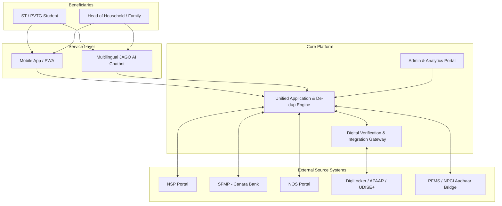
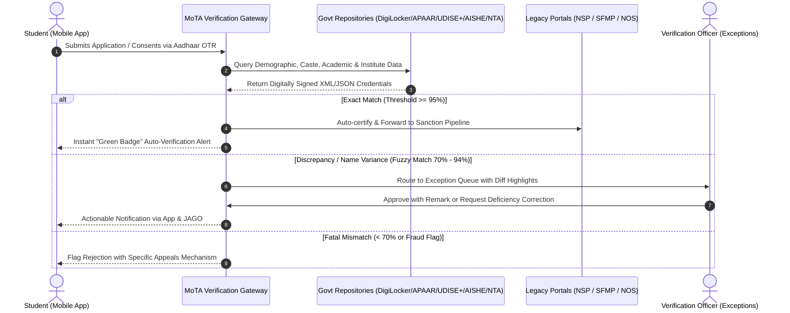

# Product Requirement Document (PRD)
## Unified MoTA Scholarship & Fellowship Platform (Mobile-First Ecosystem)

---

## 1. Document Control & Executive Summary

| Attribute | Details |
| :--- | :--- |
| **Document Title** | Product Requirement Document (PRD): Unified MoTA Scholarship Module & Integration Layer |
| **Ministry / Department** | Ministry of Tribal Affairs (MoTA), Government of India |
| **Theme / Category** | Smart Automation / Software Solution |
| **Target Audience** | ST/PVTG Students, Academic Institutions, State Verification Officers, MoTA Administrators |
| **Version** | 1.0.0 |
| **Status** | Approved for Architecture & Implementation |

### 1.1 Executive Summary
The Ministry of Tribal Affairs (MoTA) administers five major scholarship schemes for Scheduled Tribe (ST) students:
1. **Pre-Matric Scholarship for ST Students**
2. **Post-Matric Scholarship for ST Students**
3. **National Overseas Scholarship (NOS) for ST Candidates**
4. **National Fellowship for Higher Education of ST Students (NFST)**
5. **Top Class Education Scheme for ST Students**

Currently, these schemes are fragmented across three siloed legacy systems:
* **National Scholarship Portal (NSP)** (Pre-Matric, Post-Matric, Top Class)
* **Scholarship Fellowship Management Portal (SFMP - Canara Bank)** (NFST)
* **Standalone NOS Portal** (NOS)

This fragmentation causes repeated manual verification, duplicate document uploads, zero unified tracking for multi-child families or progressive students, risk of multiple concurrent scholarship violations, and friction in fund tracking. 

This PRD defines a **single, mobile-first unified platform** with:
1. **Unified Student Mobile Application & Family Dashboard**
2. **Automated/Semi-Automated Digital Verification & Integration Gateway (DVIG)** interfacing with DigiLocker, APAAR, UDISE+, AISHE, UIDAI, and State e-District portals
3. **Conversational AI Assistant (JAGO Chatbot)** with multilingual query resolution and proactive DBT alerts
4. **Outreach & Coverage Intelligence Engine** matching UDISE+/APAAR/OTR data to identify and enrol unreached tribal beneficiaries.

---

## 2. Problem Statement & Strategic Goals

### 2.1 Current Pain Points
* **Siloed Architectures:** Students applying across stages (e.g., Pre-Matric to Post-Matric, or Post-Matric to NFST/NOS) have to re-register and re-upload documents across disconnected portals.
* **Repetitive & Manual Verification:** Verifications for identity, ST/PVTG status, caste certificate authenticity, annual household income, academic performance, and institute accreditation are repeatedly performed manually, causing backlogs.
* **Lack of Rule Enforcement for De-duplication:** Under MoTA rules, an ST student cannot avail multiple concurrent government scholarships. The absence of a unified cross-scheme view makes real-time de-duplication checks difficult.
* **Opaque Tracking of Direct Benefit Transfers (DBT):** Students lack real-time visibility into PFMS/SFMP payment processing, bank account seeding/NPCI mapper statuses, rejection reasons, or deficiency remediation steps.
* **Coverage Gaps:** Millions of eligible ST students in rural and PVTG areas are enrolled in schools/colleges (captured on UDISE+ and AISHE) but fail to apply due to awareness gaps or documentation friction.

### 2.2 Strategic Goals & Objectives
| Goal ID | Objective | Target KPI |
| :--- | :--- | :--- |
| **G-01** | Unified Tracking & Management | 100% of MoTA scholarship schemes trackable under a single user/family dashboard. |
| **G-02** | Turnaround Time (TAT) Reduction | Decrease average document verification & processing cycle from 45 days to < 7 days. |
| **G-03** | Automated Zero-Paper Verification | > 80% automated document validation through API gateways (DigiLocker, APAAR, etc.). |
| **G-04** | Real-time De-duplication | 100% prevention of duplicate concurrent fellowship/scholarship disbursals. |
| **G-05** | Coverage Expansion | Proactive identification of unenrolled eligible ST students via UDISE+/APAAR cross-referencing. |
| **G-06** | Student Self-Service Support | > 70% reduction in grievance tickets through proactive JAGO multilingual assistance. |

---

## 3. User Personas & Stakeholder Matrix



### 3.1 Primary Personas
1. **Tribal Student (Pre-Matric / Post-Matric / Higher Education):**
   * *Profile:* Tech-native or limited smartphone literacy; may reside in poor internet connectivity zones.
   * *Needs:* One-click Aadhaar/DigiLocker onboarding, offline draft capabilities, regional language UI, transparent disbursement status.
2. **Family Head (Parent with multiple wards across schemes):**
   * *Needs:* Consolidated household view tracking disbursements across children in Pre-Matric and Post-Matric schemes.
3. **Institutional Verification Officer (INO) / State Nodal Officer (SNO):**
   * *Needs:* Automated pre-verified badges on applications; queue routing only for edge-cases or mismatches.
4. **MoTA Policy Maker / Programme Director:**
   * *Needs:* Coverage heatmaps, unreached beneficiary analytics via UDISE+ and AISHE gap analysis, fund utilization monitoring.

---

## 4. System Architecture & High-Level Components

The solution is architected as an event-driven, API-first microservices platform compliant with India Enterprise Architecture (IndEA 2.0) and MeitY security standards.

### 4.1 Functional Pillars
1. **Mobile-First Student Application (Flutter/React Native + PWA):**
   * Lightweight footprint (< 18 MB), biometric/Aadhaar OTP login, offline document caching, low-bandwidth mode.
2. **JAGO Conversational AI Engine:**
   * Natural Language Processing (Bhashini-integrated) supporting 12+ Indian languages and tribal dialects (e.g., Santali, Gondi, Bhili where feasible).
   * Voice-to-text and text-to-speech for low-literacy users.
3. **Unified Verification & Integration Gateway (DVIG):**
   * Microservices layer orchestrating secure RESTful API integrations with government and academic registries.
   * Mismatch resolver & exception routing queue for human-in-the-loop review.
4. **Coverage & Inclusion Analytics Service (CIAS):**
   * Secure batch & real-time matching engine comparing UDISE+/AISHE enrolment figures against registered MoTA beneficiaries.

---

## 5. Detailed Feature Specifications

### Module 1: Unified Mobile Application & Student Dashboard

#### 5.1.1 Onboarding, Identity & Family Profile
* **Single Sign-On (SSO):** Integration with MeriPehchan / DigiLocker / Aadhaar OTP and One Time Registration (OTR).
* **Automated Profile Pre-fill:** Pulls basic demographic, caste, and gender metadata upon Aadhaar authentication.
* **Household/Parental Switcher:** Enables a parent to link multiple student profiles under one parent phone number, providing a family dashboard showing total sanctions, application milestones, and DBT receipts.

#### 5.1.2 5-Scheme Unified Application Tracker
* Consolidated real-time timeline for:
  1. *Submission* $\rightarrow$ 2. *Institute Verification* $\rightarrow$ 3. *District/State Approval* $\rightarrow$ 4. *MoTA Sanction* $\rightarrow$ 5. *PFMS/SFMP DBT Generation* $\rightarrow$ 6. *Bank Account Credit*.
* **Concurrent Scheme Rule Engine:** 
  * Real-time validation preventing a student currently availing NFST from concurrently claiming Post-Matric or NOS, with clear eligibility guidelines and transition pathways (e.g., surrender of prior scheme if upgraded to fellowship).

#### 5.1.3 Digital Document Wallet (Powered by DigiLocker)
* Zero physical upload model: Fetches machine-readable credentials directly into the student wallet:
  * ST / PVTG Certificate (State e-District / DigiLocker)
  * Income & Domicile Certificates
  * Marksheets & Transcripts (APAAR / Academic Bank of Credits - ABC / CBSE / State Boards)
  * Divyangjan / Disability Certificate (UDID Portal)
  * NET / JRF Scorecards (UGC / NTA)
* **Document Reusability:** Documents verified in Pre-Matric automatically carry forward to Post-Matric or NFST applications without re-uploading.

#### 5.1.4 DBT & Payment Tracking Subsystem
* Real-time integration with **PFMS (Public Financial Management System)** and **Canara Bank SFMP**.
* Detailed failure diagnostics: Indicates precise remediation steps if disbursement fails (e.g., *“Aadhaar not seeded with bank account”*, *“NPCI mapper inactive”*, or *“Name mismatch between bank and Aadhaar”*).

---

### Module 2: Automated Digital Verification & Integration Gateway (DVIG)



#### 5.2.1 Registry Integration Matrix
| Verifiable Parameter | Primary Source Authority | Integration Standard | Fallback / Manual Trigger |
| :--- | :--- | :--- | :--- |
| **Identity & Biometrics** | UIDAI | Aadhaar Auth API / OTR | In-person biometric at CSC / School |
| **ST / PVTG Status** | State e-District / Caste Certificate Repositories via DigiLocker | Digital Signature Check / XML schema | Revenue Department Manual Upload |
| **School Affiliation & Enrolment** | UDISE+ (Department of School Education) | REST API / School Code Match | Headmaster Attestation |
| **Higher Ed Enrolment** | AISHE / APAAR (ABC ID) | IndEA 2.0 API / Student APAAR ID | College Registrar Verification |
| **UGC NET / JRF Qualification** | NTA (National Testing Agency) / UGC | Application/Roll No. API verification | Scorecard upload with OCR extraction |
| **Income Certificate** | State Revenue / e-District portals | e-District API / DigiLocker | Tehsildar signed certificate review |

#### 5.2.2 Exception & Mismatch Routing Engine
* **Fuzzy Matching:** Algorithms handle common transliteration differences between regional scripts and English (Soundex/Levenshtein matching for tribal names).
* **Non-Blocking Exception Workflow:** Minor discrepancies (e.g., missing middle name) do not freeze the application. They are routed to a triage desk with side-by-side diff highlights for instant officer sign-off.

---

### Module 3: JAGO Multilingual Conversational AI Assistant

#### 5.3.1 Capabilities & Architecture
* Built on LLM/NLU stack augmented with Retrieval-Augmented Generation (RAG) over MoTA scheme guidelines, FAQs, and real-time backend transactional APIs.
* Integrated with **Digital India Bhashini** for voice-in / voice-out across 12+ official languages and key tribal dialects.

#### 5.3.2 Functional Scenarios
1. **Personalized Status Queries:**
   * *User Query:* "Mera fellowship ka paisa kab aayega?" (When will my fellowship money arrive?)
   * *JAGO Response:* "Aapka NFST fellowship month of August sanction ho chuka hai. PFMS reference #1092822. Bank account ending in 4102 me 3 din ke andar credit ho jayega."
2. **Deficiency Resolution Guidance:**
   * Alerts student: "Aapke income certificate ka validity 31 March ko khatam ho gaya hai. Yahan tap karke naya certificate DigiLocker se link karein."
3. **Eligibility Discovery:**
   * Guided questionnaire: Recommends whether a student qualifies for Top Class or Post-Matric based on institute AISHE ranking and family income limits.

---

### Module 4: Targeted Outreach & Coverage Intelligence Engine (CIAS)

#### 5.4.1 Gap Analysis & Saturation Mapping
* **Data Ingestion:** Secure bulk matching of ST student enrolments in UDISE+ (Class IX & X for Pre-Matric, XI & XII for Post-Matric) and AISHE against active scholarship recipients.
* **Coverage Heatmap:** GIS visualization down to District, Block, and Integrated Tribal Development Agency (ITDA) project areas, highlighting drop-offs and low-coverage zones.
* **Proactive Pre-Enrolment Campaign:** 
  * Generates automated SMS and WhatsApp outreach in regional languages to parents of un-availed eligible ST students with pre-filled application links.
  * Alerts District Welfare Officers (DWOs) and Ashram School principals to conduct saturation drives.

---

## 6. Non-Functional Requirements (NFRs)

### 6.1 Performance & Scalability
* **Concurrency:** Support minimum 50,000 concurrent sessions during application deadline peaks.
* **Latency:** Dashboard load time $< 1.5\text{ s}$ over 4G; $< 3.5\text{ s}$ over 2G/3G networks.
* **API Response Time:** Digital verification lookups must return within $< 2.0\text{ s}$ for synchronous calls.

### 6.2 Security, Compliance & Data Privacy
* **Aadhaar Compliance:** Complete compliance with UIDAI Aadhaar Act 2016 regulations. No storage of raw Aadhaar numbers; Aadhaar vault with virtual tokens.
* **Data Protection:** Full adherence to the **Digital Personal Data Protection (DPDP) Act, 2023**. Strict consent management for pulling certificates from external repositories.
* **Encryption:** AES-256 for data at rest; TLS 1.3 for all data in transit.
* **Certifications:** Mandatory CERT-In audit certification prior to production go-live.

### 6.3 Accessibility & Usability (a11y)
* Conformance with **GIGW 3.0 (Guidelines for Indian Government Websites)** and **WCAG 2.1 Level AA**.
* High contrast modes, screen reader optimizations, icon-heavy intuitive navigational menus for first-generation learners.

---

## 7. Implementation Roadmap & Milestones

```mermaid
gantt
    title MoTA Unified Platform Implementation Roadmap
    dateFormat  YYYY-MM-DD
    section Phase 1: MVP & DVIG
    Architecture Design & IndEA Specs          :2026-10-01, 30d
    DVIG Core (DigiLocker, UIDAI, UDISE+, AISHE):2026-10-15, 60d
    Mobile App Alpha (Tracker & Wallet)        :2026-11-15, 60d
    section Phase 2: Pilot & JAGO
    JAGO Chatbot Integration (Bhashini)        :2027-01-15, 45d
    Multi-Scheme Cross De-dup Engine           :2027-02-01, 30d
    Field Pilot (3 States: OD, JH, MP)         :2027-03-01, 45d
    section Phase 3: Pan-India Rollout
    Outreach & Coverage Intelligence Engine     :2027-04-15, 45d
    Full Pan-India Rollout & Saturation Drive   :2027-05-15, 60d
```

### 7.1 Phased Delivery Breakdown
* **Phase 1 (Months 1–3) – Core Foundation & DVIG:** 
  * Build Verification Gateway (DVIG) connecting DigiLocker, UIDAI, and UDISE+/AISHE.
  * Deliver Alpha Mobile App with Unified Tracking and Digital Wallet.
* **Phase 2 (Months 4–6) – Intelligent Services & Pilot:**
  * JAGO Chatbot integration with Bhashini voice assistance.
  * Legacy system data bridging with NSP, SFMP, and NOS portals.
  * Launch pilot across 3 high-tribal population states (e.g., Odisha, Jharkhand, Madhya Pradesh).
* **Phase 3 (Months 7–9) – Pan-India Scaling & Analytics:**
  * Launch Coverage Intelligence Engine for saturation drives.
  * Full pan-India production rollout across all 5 schemes.

---

## 8. Key Performance Indicators (KPIs) & Success Metrics

1. **Verification Turnaround Time:** Reduction of average verification latency from 45 days down to $\le 5\text{ days}$.
2. **Auto-Verification Success Rate:** $> 75\%$ applications verified without human manual intervention.
3. **Application Drop-off Rate:** Drop-off rate during submission reduced from $> 35\%$ to $< 8\%$.
4. **Saturation Improvement:** Increase in scholarship coverage among enrolled ST students by at least $25\%$ within Year 1.
5. **DBT Failure Rate:** Reduction of disbursement failures due to invalid accounts/NPCI mapping to $< 2\%$.
6. **Chatbot Deflection Rate:** JAGO successfully resolving $\ge 70\%$ of tier-1 student inquiries autonomously.
