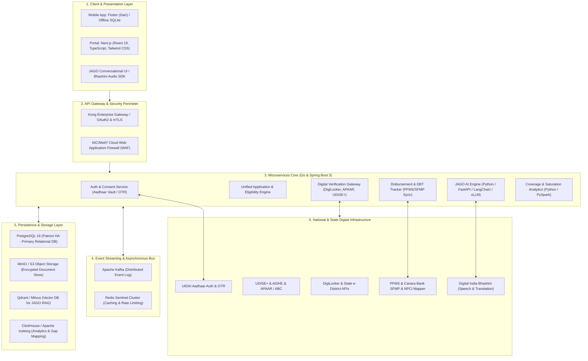
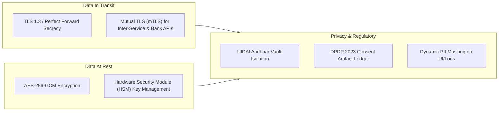

# Technical Stack & System Architecture Document
## Unified MoTA Scholarship & Fellowship Management Ecosystem

---

## 1. Document Control & Tech Overview

| Attribute | Details |
| :--- | :--- |
| **Document Title** | Technical Stack & Architecture Specification |
| **Project** | Unified MoTA Scholarship Platform, DVIG & JAGO AI Engine |
| **Target Audience** | Enterprise Architects, Backend/Frontend Engineers, DevOps, Security Audit Teams (CERT-In) |
| **Architecture Paradigm** | Cloud-Native, Microservices, Event-Driven, Mobile-First PWA |
| **Compliance** | IndEA 2.0, DPDP Act 2023, MeitY Cloud Guidelines, UIDAI Aadhaar Regulations |
| **Version** | 1.0.0 |

---

## 2. End-to-End Technology Stack Matrix



### 2.1 Detailed Technology Selection

| Tier | Component | Technology / Framework | Rationale & Justification |
| :--- | :--- | :--- | :--- |
| **Mobile Client** | Cross-Platform App | **Flutter (Dart 3.x)** | Single codebase for Android & iOS; high performance 60fps rendering even on low-end budget smartphones common in tribal regions; robust native camera/scanner and local storage handling. |
| **Web Portal** | Student / Officer Portal | **Next.js 15 (React 19, TypeScript)** | Server-side rendering (SSR) for fast initial loads, SEO/accessibility (WCAG/GIGW 3.0), and responsive performance across modern and legacy browsers. |
| **Styling & UI** | Design System | **Tailwind CSS + Radix UI (accessible primitives)** | Accessible, lightweight, high contrast mode support, and rapid component development. |
| **API Gateway** | Gateway & Security | **Kong API Gateway (Enterprise)** | Ultra-low latency (C/Lua/Nginx-based), native rate-limiting, JWT/mTLS token validation, consumer routing, and zero-trust security perimeter. |
| **Backend Services** | Verification & Transactions | **Golang (v1.23+)** | Exceptional concurrency, minimal memory footprint, and high-throughput handling of bulk registry verification calls. |
| **Backend Services** | Workflow & Business Logic | **Java 21 / Spring Boot 3.3** | Mature ecosystem for enterprise workflow state machines, batch processing, and legacy banking/PFMS integrations. |
| **Conversational AI** | JAGO Bot Microservice | **Python 3.12 + FastAPI + vLLM** | Native AI/ML ecosystem; ultra-fast async inference engine with vLLM; seamless LangGraph/LangChain integration for RAG workflows. |
| **Speech & Translation**| Multilingual Pipeline | **Digital India Bhashini SDK / APIs** | Native GoI support for Indic speech-to-text, text-to-speech, and translation across 12+ official languages and dialects. |
| **Primary Database** | OLTP Relational Data | **PostgreSQL 16 with Patroni HA** | ACID compliance, robust JSONB support for dynamic scheme schemas, Row-Level Security (RLS), and proven resilience. |
| **Vector Database** | JAGO Knowledge Retrieval | **Qdrant (or pgvector)** | Fast similarity search for scheme guidelines, FAQs, and policy documents with metadata filtering. |
| **Cache & Sessions** | In-Memory Store | **Redis Cluster 7.x** | Sub-millisecond session caching, rate-limiting counters, and temporary token storage. |
| **Message Broker** | Event-Driven Bus | **Apache Kafka (Strimzi Operator on K8s)** | Decouples heavy verification tasks, notification dispatches, and DBT audit logs; handles peak admission season traffic spikes without data loss. |
| **Document Storage** | Digital Vault / Artifacts | **MinIO (S3-compatible, Distributed)** | On-prem/Gov-cloud native object storage, encrypted at rest with envelope encryption; immutable WORM (Write Once Read Many) policy support. |
| **Analytics & OLAP** | Saturation & Gap Engine | **ClickHouse + Apache Superset** | Real-time geospatial queries comparing millions of UDISE+/AISHE records against scholarship registries in seconds. |

---

## 3. Component Deep Dive & Microservices Architecture

### 3.1 Service Decoupling & Responsibilities

#### 1. Identity & Consent Service (`auth-service`)
* Manages MeriPehchan / Aadhaar OTP / OTR authentication.
* **Aadhaar Vault Implementation:** Stores reference keys instead of actual Aadhaar numbers. Encrypted using Hardware Security Modules (HSM) adhering to UIDAI regulations.
* Implements DPDP Act 2023 granular consent artifacts (storing electronic consent logs for external data fetching).

#### 2. Digital Verification & Integration Gateway (`dvig-service`)
* **Outbound Adapters:**
  * `DigiLockerAdapter`: Pulls and parses verified XML/PDFs for caste, income, and domicile certificates.
  * `AadhaarKycAdapter`: Validates demographic identity.
  * `ApaarEduAdapter`: Fetches Academic Bank of Credits and secondary school marks via APAAR ID.
  * `UdiseAisheAdapter`: Verifies whether the institution code is active, recognized, and affiliated.
  * `NtaUgcAdapter`: Validates NET/JRF roll numbers and percentile cutoffs for NFST eligibility.
* **Fuzzy Match Engine:** Implements Levenshtein and Double Metaphone algorithms to evaluate student names across Aadhaar and state certificates, assigning a confidence score ($0.0 - 1.0$) with automated thresholds $\ge 0.92$.

#### 3. Unified Scheme & De-duplication Engine (`scheme-engine`)
* Evaluates cross-scheme eligibility across all 5 MoTA schemes.
* Maintains a centralized **Active Beneficiary Ledger (ABL)**. If a student holds an active NFST sanction, any concurrent application for Post-Matric or Top Class is automatically flagged and restricted.

#### 4. Payment & DBT Tracking Service (`dbt-sync-service`)
* Asynchronous workers poll and ingest reconciliation webhooks/SFTP files from **PFMS** and **SFMP (Canara Bank)**.
* Validates NPCI Aadhaar-Bank account mapper status.
* Publishes payment events (`PAYMENT_SANCTIONED`, `DISBURSEMENT_INITIATED`, `DBT_SUCCESS`, `DBT_REJECTED`) to Kafka.

#### 5. JAGO Conversational Engine (`jago-service`)
* **Architecture:** RAG (Retrieval-Augmented Generation) pipeline combining:
  1. *Dense Vector Search:* Embedded scheme guidelines and government notifications.
  2. *Function Calling (Tool-use):* Dynamically calls `scheme-engine` and `dbt-sync-service` APIs using student session tokens to retrieve real-time personal application and payment statuses.
  3. *Bhashini Layer:* ASR (Automated Speech Recognition) $\rightarrow$ Translation to English $\rightarrow$ LLM generation $\rightarrow$ Translation to target Indic language $\rightarrow$ TTS (Text-to-Speech).

#### 6. Coverage & Saturation Analytics Service (`cias-service`)
* Ingests anonymized/pseudonymized batch extracts of ST enrolments from UDISE+ and AISHE.
* Performs distributed joining with MoTA beneficiary records using PySpark/ClickHouse.
* Surfaces real-time saturation percentages by District, Block, and ITDA zones via GIS mapping.

---

## 4. Data Architecture & Database Schema Design

### 4.1 Core Entity Relationship Model (PostgreSQL)

```sql
-- Core Student Identity (Aadhaar-free compliant schema)
CREATE TABLE beneficiaries (
    beneficiary_id UUID PRIMARY KEY DEFAULT gen_random_uuid(),
    otr_id VARCHAR(64) UNIQUE NOT NULL,            -- One Time Registration ID
    aadhaar_token_ref VARCHAR(128) UNIQUE NOT NULL, -- UIDAI Vault Reference Token
    apaar_id VARCHAR(32) UNIQUE,                   -- One Nation One Student ID
    full_name_en VARCHAR(255) NOT NULL,
    full_name_native VARCHAR(255),
    dob DATE NOT NULL,
    gender VARCHAR(16) NOT NULL,
    category VARCHAR(16) DEFAULT 'ST',
    is_pvtg BOOLEAN DEFAULT FALSE,
    pvtg_community_name VARCHAR(128),
    household_id UUID,                             -- Links family members
    mobile_hashed VARCHAR(64) NOT NULL,
    created_at TIMESTAMPTZ DEFAULT NOW(),
    updated_at TIMESTAMPTZ DEFAULT NOW()
);

-- Master Applications Across All 5 Schemes
CREATE TABLE scheme_applications (
    application_id UUID PRIMARY KEY DEFAULT gen_random_uuid(),
    beneficiary_id UUID REFERENCES beneficiaries(beneficiary_id),
    scheme_code VARCHAR(32) NOT NULL,               -- PRE_MATRIC, POST_MATRIC, TOP_CLASS, NFST, NOS
    academic_year VARCHAR(16) NOT NULL,            -- e.g. "2026-2027"
    source_system VARCHAR(32) NOT NULL,            -- NSP, SFMP, NOS_PORTAL, DIRECT_APP
    external_ref_id VARCHAR(128),                  -- Legacy system tracking number
    institution_id VARCHAR(64) NOT NULL,           -- AISHE / UDISE+ Code
    stage VARCHAR(32) NOT NULL,                     -- APPLIED, INST_VERIFIED, STATE_VERIFIED, SANCTIONED, DISBURSED
    status VARCHAR(32) NOT NULL,                    -- IN_PROGRESS, DEFICIENT, REJECTED, APPROVED
    is_active_beneficiary BOOLEAN DEFAULT FALSE,   -- For de-duplication enforcement
    created_at TIMESTAMPTZ DEFAULT NOW(),
    updated_at TIMESTAMPTZ DEFAULT NOW()
);

-- Verification Records & Registry Tracing
CREATE TABLE verification_logs (
    log_id UUID PRIMARY KEY DEFAULT gen_random_uuid(),
    application_id UUID REFERENCES scheme_applications(application_id),
    registry_source VARCHAR(64) NOT NULL,          -- DIGILOCKER, UDISE, AISHE, NTA, UIDAI
    credential_type VARCHAR(64) NOT NULL,          -- CASTE_CERT, INCOME_CERT, MARKSHEET
    verification_mode VARCHAR(16) NOT NULL,        -- AUTO_API, HUMAN_EXCEPTION
    match_confidence_score NUMERIC(5,2),           -- 0.00 to 100.00%
    verification_status VARCHAR(32) NOT NULL,      -- VERIFIED, MISMATCH, MANUAL_REVIEW_PENDING
    digital_signature_valid BOOLEAN,
    officer_remarks TEXT,
    verified_at TIMESTAMPTZ DEFAULT NOW()
);

-- DBT Disbursal Milestones
CREATE TABLE dbt_disbursements (
    disbursement_id UUID PRIMARY KEY DEFAULT gen_random_uuid(),
    application_id UUID REFERENCES scheme_applications(application_id),
    amount_inr NUMERIC(10,2) NOT NULL,
    pfms_transaction_id VARCHAR(128),
    sfmp_ref_number VARCHAR(128),
    npci_status VARCHAR(64),                       -- SEEDED_AND_ACTIVE, INACTIVE, MAPPED_DIFF_BANK
    dbt_status VARCHAR(32) NOT NULL,               -- SANCTIONED, SENT_TO_PFMS, PROCESSED, FAILED
    failure_reason_code VARCHAR(64),
    remediation_guidance TEXT,
    disbursed_at TIMESTAMPTZ
);
```

---

## 5. Security, Cryptography & Compliance Architecture



1. **Aadhaar Protection & Tokenization:**
   * Raw Aadhaar numbers are never stored in plain text or transmitted across microservices.
   * Authentication is performed via UIDAI's Registered Device (RD) Service / OTP API. Once authenticated, a unique cryptographic UUID token is generated and mapped inside an isolated Aadhaar Vault within a dedicated VPC.
2. **DPDP Act (2023) Compliance:**
   * Every interaction retrieving data from DigiLocker, APAAR, or e-District systems logs an immutable consent token detailing purpose, timestamp, and validity period.
   * Right to erasure and data minimization features built into the user settings.
3. **Network Architecture & Hardening:**
   * Deployed on MeitY-empanelled Cloud Service Provider (Gov-Cloud: NIC / MeghRaj / AWS GovCloud India).
   * Web Application Firewall (WAF) blocking OWASP Top 10 vulnerabilities, automated DDoS mitigation, and Zero-Trust private subnet isolation between ingress and database nodes.

---

## 6. DevOps, Infrastructure & CI/CD Pipeline

### 6.1 Infrastructure Specifications

| Environment Component | Specification |
| :--- | :--- |
| **Container Orchestration** | Kubernetes (K8s v1.30+) managed via Rancher / OpenShift |
| **Compute Scaling** | Horizontal Pod Autoscaler (HPA) targeting 70% CPU/Memory threshold; Keda for Kafka consumer queue autoscaling |
| **CI/CD Automation** | GitLab CI / GitHub Actions with automated SonarQube static code analysis and OWASP ZAP vulnerability scanning |
| **Observability & APM** | Prometheus + Grafana (Metrics), OpenTelemetry + Jaeger (Distributed Tracing), Fluentbit + OpenSearch (Centralized Logs) |
| **Disaster Recovery (DR)** | RPO (Recovery Point Objective) $< 15\text{ mins}$; RTO (Recovery Time Objective) $< 2\text{ hours}$ with Warm-Standby across alternate MeitY data center zones |

---

## 7. Performance Benchmarks & High-Availability Targets

| Metric | Target SLA | Benchmark Strategy |
| :--- | :--- | :--- |
| **Peak Throughput** | 10,000 requests/second | Stress-tested using k6 distributed load testing during peak intake periods. |
| **P99 Read Latency** | $< 250\text{ ms}$ | Redis query caching on static catalogs and scheme metadata. |
| **P99 Verification Latency** | $< 2.5\text{ s}$ | Asynchronous registry calls with circuit breakers (Resilience4j). |
| **System Uptime** | $99.95\%$ Availability | Multi-AZ deployment with active-active service replicas and Patroni database clustering. |
| **Mobile App Size** | $< 18\text{ MB}$ initial download | Asset compression, tree-shaking, and on-demand model/asset streaming. |
